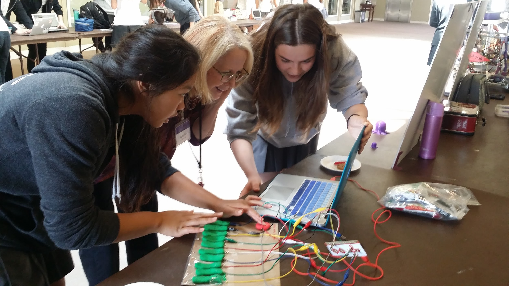

 
# Coding & Making  

### 10 Great Things That Go Great Together

 

__Windward Design + Maker Class Colloquium__  
__August 3, 2017__  
  

.center.purple[
Darren Kessner, PhD  
Math and Computer Science Instructor  
STEM Program Co-Head  
Marlborough School  
Darren.Kessner@marlborough.org  
[http://stem.marlborough.org](http://stem.marlborough.org)
]
---

## Marlborough School

* Located in Hancock Park
* All girls (~500 total)
* Middle School (7-9) and Upper School (10-12)

 

.center[

]
---

## My background

* Mathematics (BS, MA), Bioinformatics (PhD)

* Software development
    - Anti-virus security
    - Computer graphics / user interface
    - Scientific applications (biology)

* starting 4th year at Marlborough School
    - Math and Computer Science Instructor
    - STEM Program Co-Head
    - develop Computer Science curriculum
---

## Co-conspirator

__Andy Witman__  
Science Instructor  
Robotics Coach  
STEM Program Co-Head
---

## Marlborough STEM Program

 

Emphasis on STEM activities that are:

* Creative
* Collaborative
* Interdisciplinary

 

---

## Computer Science curriculum

* Main focus: 
    - Processing -> Java
    - computer graphics, artistic creation, video games

* Supplementary: 
    - command line
    - HTML / CSS / Javascript
    - Arduino

* Math and Science classes
    - Python
    - Scratch
---

class: middle

.center[
### Toys are not really as innocent as they look. Toys and games are preludes to serious ideas.
__ _Charles Eames_ __
]

---

## Video Game Cabinet

* Linux mini-computer
* Joysticks and buttons mapped to keyboard (Makey Makey)
* Student programs written in Processing or Java
* Custom menu system (Processing / Java)
---

## LED Hat

* 150 NeoPixels (individually addressable RGB LEDs), controlled by Flora
    (Arduino-compatible) micro-controller.

* Raspberry Pi connected to Flora (USB serial connection).

* Web page on Raspberry Pi calls CGI script (Python) when the form is submitted, 
    which sends message to the Flora via the serial connection.
---

## BrickPi robots

* BrickPi is an interface between the Raspberry Pi and Lego Mindstorms motors
  and sensors.

* Give new life to your Lego motors and sensors!

Advantages:
- full Raspberry Pi Linux system
- programming with Python or other languages
- web server
- camera
---

## Thank you!

Links:

* [Processing](http://processing.org) open source language and software
* [Arduino](https://www.arduino.cc) open source software and hardware
* [Raspberry Pi](https://www.raspberrypi.org) mini-computer
* [Adafruit](https://www.adafruit.com) website for electronics supplies and tutorials
  (Flora, NeoPixels)
* [Makey Makey](http://makeymakey.com) USB keyboard physical interface
* [Dexter Industries](https://www.dexterindustries.com/brickpi) Brick Pi 
* [remark](https://github.com/gnab/remark) Markdown-based slideshow tool (e.g. this presentation)

