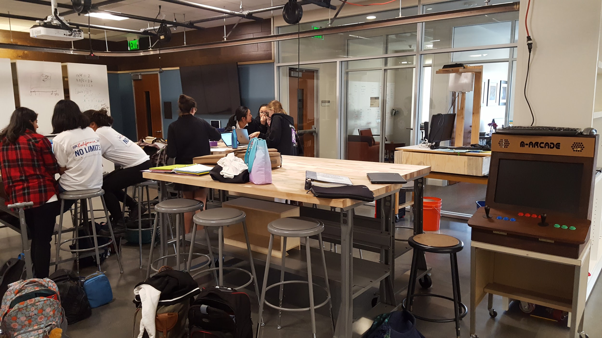

.center[
### Graphics programming in Java   with the   Processing software libraries

 

_Design and Maker Class Colloquium_  
_Windward School, Los Angeles_  
_June 11, 2019_  

 
]

.center.purple[
Darren Kessner, PhD  
Math and Computer Science Instructor  
STEM+ Program Co-Head  
Marlborough School  
Darren.Kessner@marlborough.org  
[http://stem.marlborough.org](http://stem.marlborough.org)
]
---

## Marlborough School

* Located in Hancock Park

* All girls (~500 total)

* Middle School (7-9) and Upper School (10-12)

.center[

]
---

## My background

 
5 years at Marlborough School

- Math and Computer Science Instructor

- STEM+ Program Co-Head

- Computer Science curriculum coordinator

 

Education / experience: 

* Mathematics (BS, MA), Bioinformatics (PhD)

* worked in software development for 20 years
    - Anti-virus security
    - Computer graphics / user interface
    - Scientific applications (biology)

---

## Marlborough STEM+ Program

Emphasis on STEM activities that are creative, collaborative, and interdisciplinary:

* Computer Science

* Robotics (Andy Witman)

* Engineering (Dr. Lee Hamill)

 

---

## Computer Science curriculum

* Computer Science Core Curriculum

    - Introductory Elective _(Processing)_

    - AP Computer Science A  _(Java)_

    - Honors CS Projects  _(Processing, Java, Python, Arduino)_

 

* Other Coding: 

    - Robotics _(Java)_

    - Math _(Python)_

    - Physics _(Scratch)_

    - Coding Electives _(HTML/CSS/Javascript, Arduino)_

---

## Video Game Cabinet

* Linux mini-computer
* Joysticks and buttons mapped to keyboard (Makey Makey)
* Student programs written in Processing or Java
* Custom menu system (Processing / Java)

 

<small>
_Toys are not really as innocent as they look. Toys and games are preludes to serious ideas._
__ Charles Eames __
</small>

---

## Processing Libraries and Java

Processing is an open source language and development environment that is used
by educators and artists worldwide.

The Processing libraries (`.jar` files) can be used directly from Java programs,
easing the transition from an introductory coding class to AP Computer Science A.

 

[GitHub documentation and project](https://dkessner.github.io/ProcessingLibraryExamples/)  

