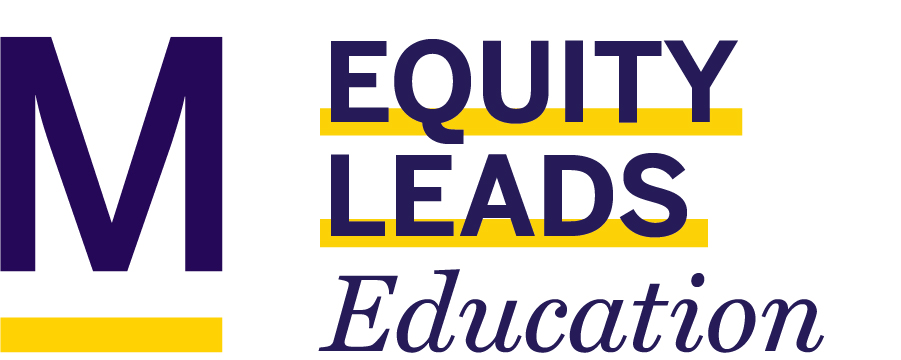
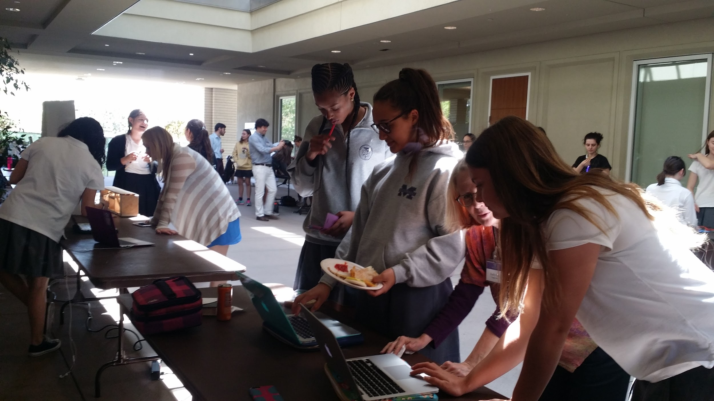
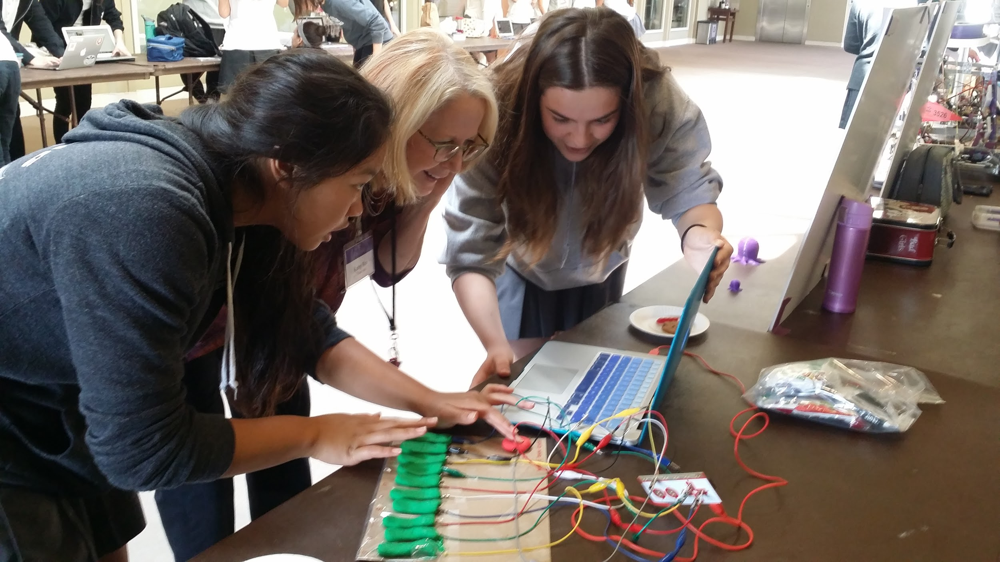
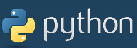

layout: true

.logo[

]

.logo2[
<a href="http://stem.marlborough.org" target="_blank">
http://stem.marlborough.org
</a>
]

---

.center[
# Open Educational Resources   for   Teachers

 

_Grab & Go_  
<a href="https://stem.harpethhall.org/think-tank-conference/think-tank-overview" target="_blank">STEM Think Tank & Conference</a>  
_February 6, 2021_  

 
]

.center.purple[
Darren Kessner, PhD  
STEM+ Program Co-Head  
Math and Computer Science Instructor  
Marlborough School  
Darren.Kessner@marlborough.org  
]

---

## Marlborough School

* Girls independent school  in Los Angeles 

* ~500 students

* Middle School (7-9) and Upper School (10-12)

 

---

## My Background

 
7th year at Marlborough School:

- Math and Computer Science Instructor

- STEM+ Program Co-Head

- Computer Science curriculum coordinator

 

Education / experience: 

* Mathematics (BS, MA), Bioinformatics (PhD)

* worked in software development for 20 years
    - Anti-virus security
    - Application development: computer graphics
    - Scientific applications (biology)

---

## Marlborough STEM+ Program

Emphasis on STEM activities that are creative, collaborative, and interdisciplinary:

* Computer Science

* Robotics (Andy Witman)

* Engineering (Dr. Lee Hamill)

 

---

## Computer Science Curriculum

* Computer Science Classes:

    - Computer Programming _(Processing)_

    - AP Computer Science A  _(Java)_

    - Honors CS Projects  _(Processing, Java, Python, Arduino)_

 

* Other Coding: 

    - Robotics _(Java)_

    - Engineering _(Arduino)_

    - Math _(Python)_

    - Physics _(Scratch)_

    - Code Violet club

---

## Free & Open Source Software

_What is FOSS?_
    - freedom to use, copy, and change
    - source code published
_Benefits_
    - user control
    - privacy and security
    - quality and stability
    - no cost
_FOSS is everywhere_

    - every web service 
        - Amazon Web Services, Google, Microsoft
        - Zoom, Facebook, Netflix, LinkedIn, Twitch, YouTube

    - every device
        - Android (Linux)
        - Apple iOS/MacOS (BSD)

---

## Open Source Educational Software

       

.center[

  

 

   Arduino

]

---

## Open Educational Resources

.center[

Online courses

 

Open textbooks

 

Public domain books

]

---

## Open Textbooks

AP Computer Science A

* <a href="http://math.hws.edu/javanotes" target="_blank">David J Eck, Introduction to Programming Using Java</a>
* <a href="https://en.wikibooks.org/wiki/Java_Programming" target="_blank">Wikibooks Java Programming</a>

Precalculus (Honors, Accelerated)

* <a href="https://www.stitz-zeager.com" target="_blank">Stitz Zeager Precalculus</a>
* <a href="https://openstax.org/details/books/precalculus" target="_blank">OpenStax Precalculus</a>
* <a href="https://openstax.org/details/books/calculus-volume-1" target="_blank">OpenStax Calculus Vol 1</a>

Multivariable Calculus

* <a href="https://openstax.org/details/books/calculus-volume-3" target="_blank">OpenStax Calculus Vol 3</a>
* <a href="https://www.whitman.edu/mathematics/calculus_online/" target="_blank">David Guichard, Single and Multivariable Calculus</a>
* <a href="https://ocw.mit.edu/resources/res-18-001-calculus-online-textbook-spring-2005/textbook/" target="_blank">Strang, Calculus</a>

---

## Open Data

.center[

Example: Social Security baby names  
(2019: Olivia, Emma, Ava, Sophia, Isabella)

 

Example: LAPD crime data 

]

---

  

.center[

  

Teacher Resources

### <a href="https://dkessner.github.io/TeacherResources" target="_blank">https://dkessner.github.io/TeacherResources</a>

]

