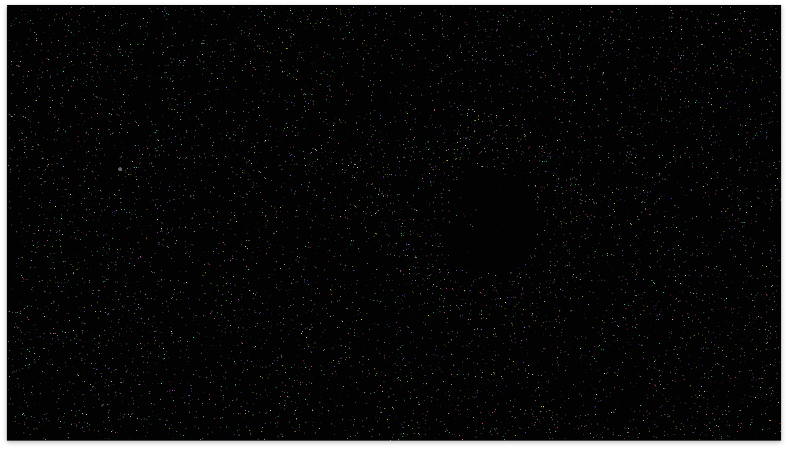
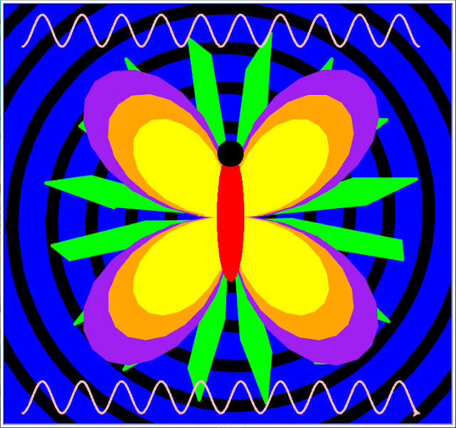

.center[
## Building a Fun and Exciting Computer Science Curriculum

 

_2019 NCGS Conference_  
_Westridge School, Los Angeles_  
_June 25, 2019_  

 
]

.center.purple[
Darren Kessner, PhD  
Math and Computer Science Instructor  
STEM+ Program Co-Head  
Marlborough School  
Darren.Kessner@marlborough.org  
[http://stem.marlborough.org](http://stem.marlborough.org)
]
---

## Marlborough School

* All girls independent school, located in Hancock Park

* Middle School (7-9) and Upper School (10-12)

* ~500 total students

.center[

]
---

## My background

 
5 years at Marlborough School:

- Math and Computer Science Instructor

- STEM+ Program Co-Head

- Computer Science curriculum coordinator

 

Education / experience: 

* Mathematics (BS, MA), Bioinformatics (PhD)

* worked in software development for 20 years
    - Anti-virus security
    - Computer graphics / user interface
    - Scientific applications (biology)

---

## Marlborough STEM+ Program

Emphasis on STEM activities that are creative, collaborative, and interdisciplinary:

* Computer Science

* Robotics (Andy Witman)

* Engineering (Dr. Lee Hamill)

 

---

## Computer Science curriculum

* Computer Science Core Curriculum

    - Introductory Elective _(Processing)_

    - AP Computer Science A  _(Java)_

    - Honors CS Projects  _(Processing, Java, Python, Arduino)_

 

* Other Coding: 

    - Robotics _(Java)_

    - Math _(Python)_

    - Physics _(Scratch)_

    - Coding Electives _(HTML/CSS/Javascript, Arduino)_

---

.center[

## Coding and the Visual Arts
  
[Intro Coding](https://docs.google.com/presentation/d/e/2PACX-1vQbl6ehE3egw6l0cnLnrl1AlRIriBe2pgYAXdjF5n5I6vR_o-CkwHrCaVr6WZ5ICrY6jwYtYLZc7BsZ/pub?start=false&loop=true&delayms=3000#slide=id.g4bb6c39a5a_0_0)  
[SPARC Celebration 2019](https://photos.google.com/share/AF1QipPo1kFd0xEwpD_Vy1_-TKytODE97tlvxcIDkPAunK4dpsqHqm3ei2dDqHQMhChOYQ?key=d2NKUTZkT1p1c0RueTVSekh5QTgzZU9ucHJDN2RR)
[STEM + Arts 2018](https://photos.google.com/share/AF1QipNcahE5U7niniblHE919BuSblMAyAmF7tscjNpcfUysr0j5ff5hSiFekeNLjqInrA?key=VlBxbUM4b2RlUTNYd3Nvdzg0bmdLR2ZBcFM2Wkhn)  
[SPARC Celebration 2018](https://photos.google.com/share/AF1QipN0fegBzrSbaMfKjGkLmshivHj3aWR6vB2GoS7Jyj6g1fM5E9XFEmQLtl-G8dTvmQ?key=ekMweUpJR1c4Zm1sLV9BUXN0NjhmVjZDYktySDlR)
[STEM + Arts 2017](https://photos.google.com/share/AF1QipOYErHZ6rmoobXG3zS9jQ7RG6VIFG3rLg6cVSaqXo79FLSlwtyufeV8b-JLC_xAQA?key=OS0tdEM0bERudnhHeGR4Q05YclpqWF8xeExDWEdn)
]

---

.center[

## Video Games

Students write video games in Processing / Java.  

Joysticks and buttons are mapped to keyboard controls on the video game
cabinet.  

<small>
_Toys are not really as innocent as they look.   
Toys and games are preludes to serious ideas._  
__ Charles Eames __
</small>
]

---

.center[
## Coding and the   Performing Arts 

http://stem.marlborough.org/blog/dance-projections/

]

---

.center[
## Coding and Math / Science

Math: Python in several classes  
Physics: Scratch video game project  

[PCHA 2018](https://photos.google.com/share/AF1QipPDFP22D4EkkfNqLV7-N2EF5BLhUz4I2fvvUIQKirqNAEes7zKnBUZ5zZ4ptd0luA?key=Rl9NZ3F1T3FJeG1jTjNfdnRhVmxFOE43UzRfUHJR)
[PCHA 2019](https://photos.google.com/share/AF1QipMbvGup2sTzPtKLVWtEuHJid09a67RHUqHN1MqtLKhU13PY42xveCc-mHgGAUReWg?key=azhLM0s0NHg5elY3clB6UmEyUlNWT01tUm8tUUV3)
]

---

## Resources and Links

Marlborough School  
[http://marlborough.org](http://marlborough.org)

Marlborough STEM+ Program  
[http://stem.marlborough.org](http://stem.marlborough.org)

Processing open source language and development environment
[http://processing.org](http://processing.org)

Book chapter on Computer Science education
[http://stem.marlborough.org/blog/kessner-book-chapter/](http://stem.marlborough.org/blog/kessner-book-chapter/)

Processing Lessons and Examples  
[http://stem.marlborough.org/coding](http://stem.marlborough.org/coding/)

Processing Library Examples  
[https://dkessner.github.io/ProcessingLibraryExamples/](https://dkessner.github.io/ProcessingLibraryExamples/)  

